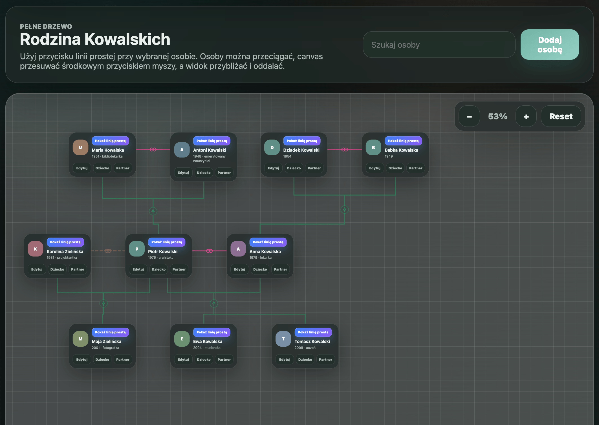
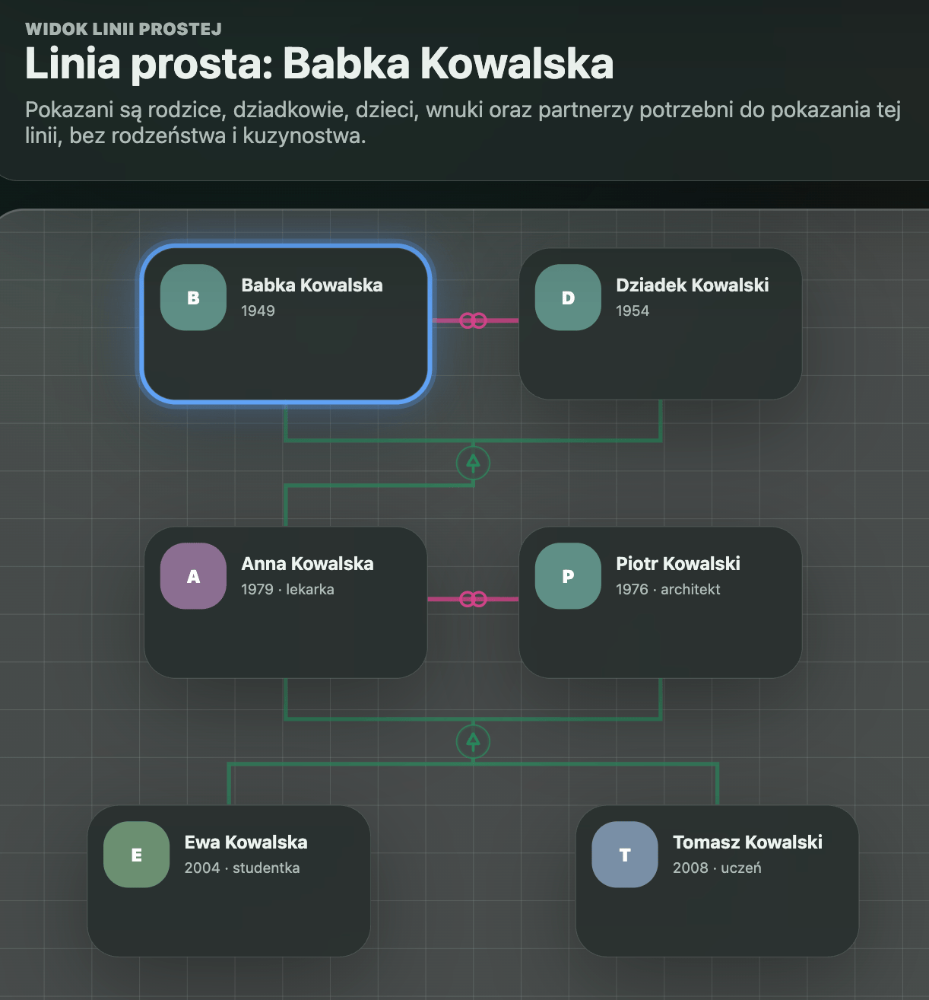
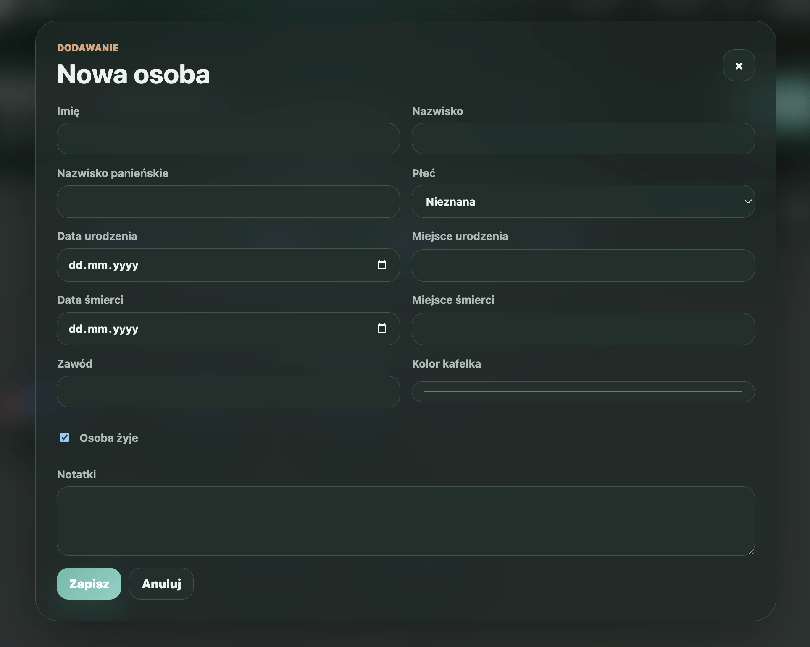
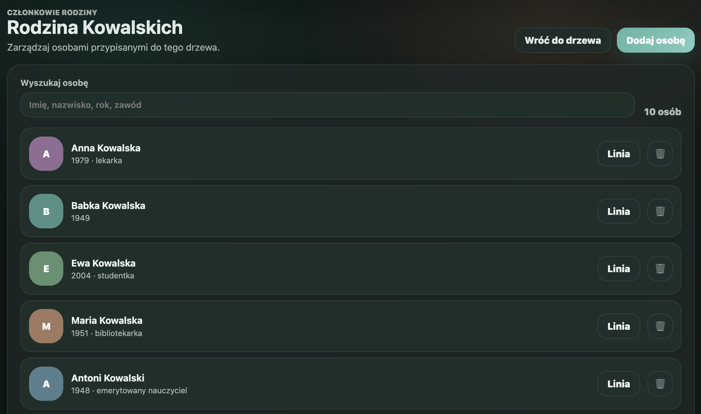

# Linely

Prosty projekt aplikacji webowej do tworzenia drzew genealogicznych.

## Uruchomienie

```bash
docker compose down -v
docker compose up -d --build
```

Aplikacja będzie dostępna pod adresem:

```text
http://localhost:8080
```

PgAdmin:

```text
http://localhost:5050
```

## Konta testowe

| Rola | Email |
| --- | --- |
| Administrator | admin@example.com |
| Użytkownik | user@example.com |

## Najważniejsze funkcje

### Logowanie i role użytkowników

- logowanie i rejestracja użytkowników,
- osobne role użytkownika i administratora,
- panel użytkownika z listą jego drzew genealogicznych,
- panel administratora z listą użytkowników i wszystkich drzew,
- możliwość usuwania drzew oraz użytkowników przez administratora.

### Zarządzanie drzewami genealogicznymi

- tworzenie wielu drzew genealogicznych,
- przechodzenie z listy drzew do pełnego widoku konkretnego drzewa,
- przechowywanie właściciela, nazwy i opisu drzewa,
- automatyczne utworzenie przykładowego drzewa demonstracyjnego po uruchomieniu świeżej bazy.

### Pełny widok drzewa



- interaktywny widok drzewa na dużym canvasie,
- osoby prezentowane jako kafelki z inicjałem, imieniem, nazwiskiem, rokiem urodzenia i zawodem,
- widoczne relacje partnerskie oraz relacje rodzic-dziecko,
- wyszukiwarka osoby bezpośrednio nad drzewem,
- przyciski szybkiej akcji przy każdej osobie: edycja, dodanie dziecka, dodanie partnera i przejście do linii prostej,
- przeciąganie osób po canvasie,
- automatyczny zapis pozycji po przesunięciu osoby,
- przyciąganie pozycji do siatki,
- przesuwanie canvasu środkowym przyciskiem myszy,
- zoomowanie widoku drzewa oraz szybki reset powiększenia.

### Widok linii prostej



- osobny tryb prezentujący uproszczoną linię genealogiczną wybranej osoby,
- pokazanie rodziców, dziadków, dzieci, wnuków oraz partnerów potrzebnych do zrozumienia tej linii,
- ukrycie rodzeństwa i kuzynostwa, aby widok był czytelniejszy,
- wyróżnienie osoby, dla której aktualnie oglądana jest linia prosta,
- możliwość powrotu do pełnego drzewa.

### Dodawanie i edycja osób



- dodawanie nowej osoby z poziomu pełnego drzewa lub listy członków rodziny,
- edycja osoby w modalnym formularzu,
- obsługa podstawowych danych: imię, nazwisko, nazwisko panieńskie, płeć, daty i miejsca urodzenia oraz śmierci, zawód, kolor kafelka, status życia i notatki,
- dodawanie dziecka jako nowej osoby lub łączenie istniejącej osoby jako dziecka,
- wybór drugiego rodzica przy dodawaniu relacji rodzic-dziecko,
- dodawanie relacji partnerskich między istniejącymi osobami.

### Lista członków rodziny



- osobny widok listy osób przypisanych do konkretnego drzewa,
- wyszukiwanie po imieniu, nazwisku, roku, zawodzie i innych danych opisowych,
- licznik osób w aktualnym widoku,
- szybkie przejście do linii prostej danej osoby,
- usuwanie osoby z drzewa,
- paginacja listy przy większej liczbie osób.

### Interfejs i wygoda pracy

- responsywny interfejs,
- jasny i ciemny motyw,
- modalne formularze bez przeładowywania całego kontekstu pracy,
- pop-upy akcji przy osobach na drzewie,
- czytelne rozdzielenie widoku drzewa, widoku linii prostej i listy osób.

### Bezpieczeństwo

- ochrona przed SQL Injection przez prepared statements,
- walidacja e-maila po stronie serwera,
- hasła przechowywane jako hash,
- CSRF tokeny w formularzach,
- ograniczenie długości danych wejściowych,
- regeneracja ID sesji po poprawnym logowaniu,
- cookie sesyjne z flagami Secure, HttpOnly i SameSite,
- limit nieudanych prób logowania z czasową blokadą,
- audyt nieudanych logowań bez zapisywania haseł,
- escapowanie danych w widokach jako ochrona przed XSS,
- sensowne kody HTTP dla błędów i brak surowych stack trace dla użytkownika.

## Struktura projektu

```text
public/
  index.php
  scripts/
  styles/
  views/
src/
  controllers/
  repositories/
config.php
Database.php
index.php
Routing.php
```

Po zmianach w `docker/db/init.sql` warto uruchomić projekt komendą `docker compose down -v`, żeby baza została utworzona od nowa z aktualnego schematu.

## Testy

Testy nie wymagają dodatkowych zależności. Uruchomienie całego zestawu:

```bash
docker compose up -d server db
docker compose run --rm php php /app/tests/run.php
```

Osobne zestawy:

```bash
docker compose run --rm php php /app/tests/run.php unit
docker compose run --rm php php /app/tests/run.php e2e
```

Testy E2E działają po HTTP(S) na uruchomionej aplikacji, ustawiają znane hasła kont demo i czyszczą dane testowe z prefiksem `E2E_`. Obejmują logowanie, rejestrację, CSRF, uprawnienia, CRUD drzewa, listę osób, dodawanie/edycję/usuwanie osoby, relacje partner-dziecko oraz panel administratora.
